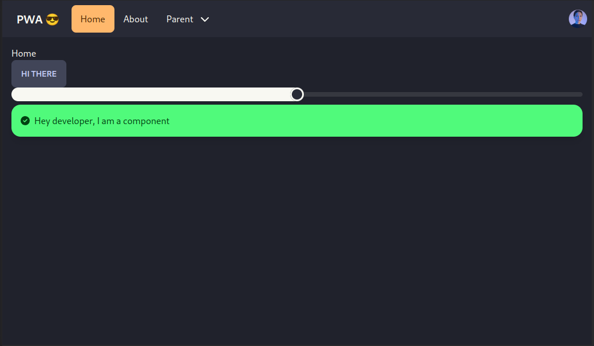
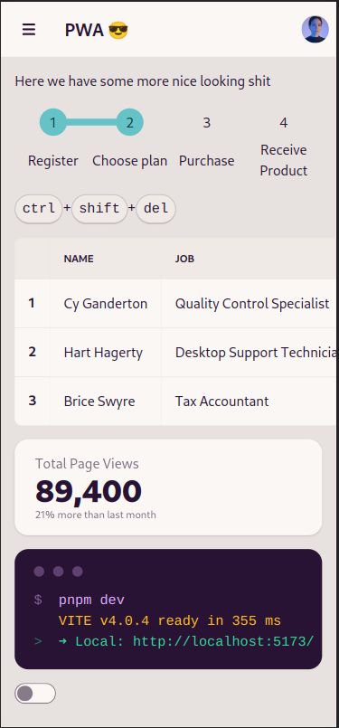
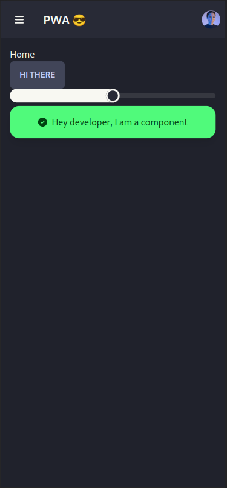

# PWA React App template

## 📚 Stack
- 📦 [pnpm](https://pnpm.io/) (package manager)
- 💙 [TypeScript](https://www.typescriptlang.org/)
- ⚛️ [React](https://reactjs.org/) (framweork)
- 🚦 [React Router](https://reactrouter.com/) (routing)
- ⚡️ [Vite](https://vitejs.dev/) (dev server and bundling)
- 📱 [Vite PWA Plugin](https://vite-pwa-org.netlify.app/) (for native app experience)
- 💄 [TailwindCSS](https://tailwindcss.com/) (utility classes)
- 🌻 [daisyUi](https://daisyui.com/) (tailwindcss components)
- 🔣 [Fontawesome](https://fontawesome.com/) (icons)

## 🖼️ Screenshots
|                             Light                              |                             Dark                             |
| :------------------------------------------------------------: | :----------------------------------------------------------: |
|  |  |
|   |   |

## 🔨 Development
- 🌍 `pnpm install` to install dependencies
- 🔨 `pnpm dev` to start dev server
- ⚙️ `pnpm build` to build the app

## 🌍 Netlify settings
leave everything as is except for build command, change it to `pnpm build`

## 🔣 Generate your app icons
1. upload svg or png [here](https://realfavicongenerator.net/) and download the zip file
2. extract the images in the `public` folder